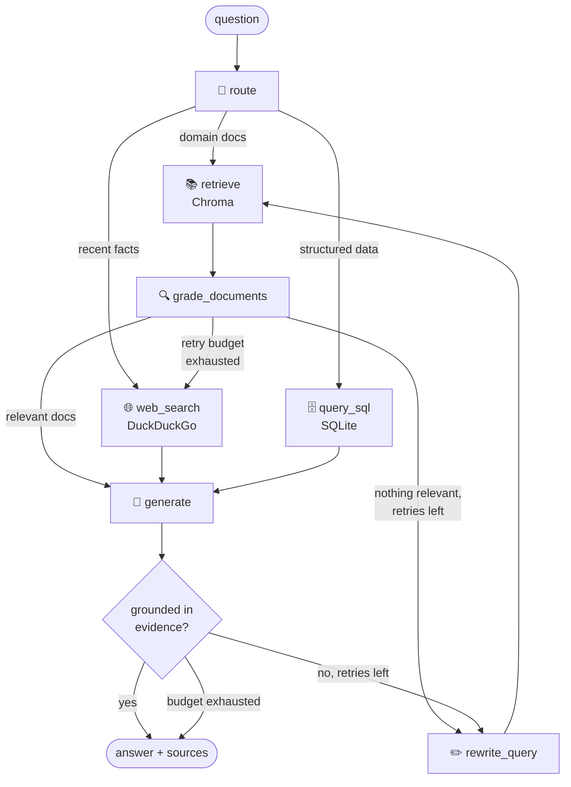

# 🧭 Multi-Source Agentic RAG

A student-built **Agentic RAG system** using **LangGraph** that can decide where to search for an answer, evaluate the retrieved information, and retry when the available evidence is not good enough.

The project combines **document retrieval, SQL-based data querying, and web search** into a single workflow.

## 🚀 Features

- 🧠 **LLM:** Groq API using `ChatGroq`
- 🔤 **Embeddings:** Sentence Transformers (`paraphrase-multilingual-MiniLM-L12-v2`)
- 🗂️ **Vector Store:** Chroma
- 🌐 **Web Search:** DuckDuckGo
- 🗄️ **Structured Data:** SQLite + Text-to-SQL
- 🔄 **Agentic workflow:** LangGraph
- 📊 **Evaluation:** RAGAS
- 🖥️ **Interface:** Streamlit + CLI

## How It Works

Instead of sending every question to the same retriever, the system first decides which source is most suitable for the question.



### Main Parts

1. **Adaptive Routing**
   The system uses an LLM-based router to decide whether the question should be answered using the document knowledge base, SQL database, or web search.

2. **Document Grading**
   Retrieved documents are checked for relevance before they are passed to the generator.

3. **Query Rewriting**
   If the retrieved documents are not useful, the question is rewritten and retrieval is attempted again.

4. **Answer Verification**
   The generated answer is checked against the available evidence. If the answer is not sufficiently grounded, the system can retry.

5. **Bounded Self-Correction**
   Retry attempts are limited using `MAX_RETRIES`, so the workflow does not continue indefinitely.

## 🛠️ Tech Stack

| Component           | Technology            |
| ------------------- | --------------------- |
| LLM                 | Groq / ChatGroq       |
| Agent Framework     | LangGraph             |
| LLM Framework       | LangChain             |
| Embeddings          | Sentence Transformers |
| Vector Database     | Chroma                |
| Structured Database | SQLite                |
| Web Search          | DuckDuckGo            |
| Evaluation          | RAGAS                 |
| UI                  | Streamlit             |
| Language            | Python                |


## 💡 Example Questions

The project supports different types of questions depending on the required source.

| Question                                          | Expected Source |
| ------------------------------------------------- | --------------- |
| "What is retrieval grading and why is it useful?" | 📚 Vector Store |
| "Which product had the most sales in Spain?"      | 🗄️ SQL         |
| "What happened in the news today?"                | 🌐 Web Search   |

## 📂 Bring Your Own Data

### Text Documents

You can add `.md`, `.txt`, or `.pdf` files to:

```text
data/documents/
```

Then run:

```bash
agentic-rag-ingest
```

The documents are chunked, converted into embeddings, and stored in Chroma for retrieval.

You can also update `KB_DESCRIPTION` in `.env` so that the router has a better description of the available knowledge base.

### Tabular Data

For structured data such as `.csv` and `.xlsx` files, SQL is used instead of relying on text embeddings for numerical questions.

For example:

> "Which product sold the most?"

This type of question is better handled using SQL because the database can perform exact aggregations.

Place your files inside:

```text
data/tables/
```

Then run:

```bash
agentic-rag-ingest-csv
```

Each file is converted into a SQLite table.

## 📊 Evaluation

The project includes an evaluation pipeline using **RAGAS**.

Run:

```bash
python evaluation/run_evaluation.py
```

The evaluation measures:

| Metric                 | What it measures                                                |
| ---------------------- | --------------------------------------------------------------- |
| **Faithfulness**       | Whether the answer is supported by the retrieved evidence       |
| **Response Relevancy** | Whether the answer addresses the question                       |
| **Context Precision**  | Whether relevant information is ranked properly                 |
| **Context Recall**     | Whether the retrieved context contains the required information |

The results are saved to:

```text
evaluation/results.csv
```

These metrics can be used to compare different changes to the retrieval and generation pipeline.

## 🧠 Design Decisions

### Adaptive Routing

Different questions require different sources. The router therefore decides between:

- Vector retrieval for knowledge-based questions
- SQL for structured/tabular questions
- Web search for recent information

### Retrieval Grading

Retrieved documents are checked before generation. This helps prevent irrelevant chunks from being directly passed to the LLM.

### Query Rewriting

When retrieval does not provide useful information, the system rewrites the query and retries the retrieval step.

### Self-Correction

The generated answer is checked against the available evidence. If the answer is not sufficiently grounded, the workflow can retry within the configured retry limit.

### SQL Safety

The SQL tool is designed to execute read-only queries. Generated SQL is validated before execution so that destructive database operations are not allowed.

### Bounded Retries

Self-correction loops use `MAX_RETRIES` to prevent unnecessary or infinite LLM calls.

## 📁 Project Structure

```text
agentic-rag/
│
├── app.py                         # Streamlit interface
│
├── src/agentic_rag/
│   ├── config.py                  # Environment/configuration
│   ├── ingestion.py               # Document ingestion and Chroma
│   ├── tabular.py                 # CSV/Excel → SQLite
│   ├── cli.py                     # Command-line interface
│   │
│   ├── graph/
│   │   ├── state.py               # Shared graph state
│   │   ├── chains.py              # LLM chains
│   │   ├── nodes.py               # Graph nodes and routing logic
│   │   └── build.py               # Graph construction
│   │
│   └── tools/
│       ├── web_search.py           # DuckDuckGo search
│       └── sql.py                  # Read-only Text-to-SQL
│
├── evaluation/
│   ├── dataset.json               # Evaluation questions
│   └── run_evaluation.py          # RAGAS evaluation
│
├── data/
│   ├── documents/                 # Knowledge base documents
│   ├── tables/                    # Tabular datasets
│   └── sample.db                  # Sample SQLite database
│
├── scripts/
│   └── create_sample_db.py        # Creates sample database
│
└── tests/                         # Unit tests
```

## 🐳 Docker

The application can also be run using Docker.

Before starting the container, provide your Groq API key through the environment.

```bash
docker compose up -d
```

Then open:

```text
http://localhost:8501
```

The application uses **Groq for LLM inference**, while embeddings and the vector database remain part of the local application environment.
